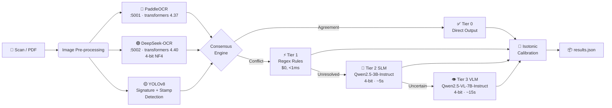

<div align="center">

# 🚜 IDAI — Intelligent Document AI Pipeline

### Automated tractor loan invoice extraction at **≥95% accuracy**, **<$0.01/doc**, **<30s latency**

*A production-grade MLOps pipeline that runs ensemble OCR, YOLOv8 visual detection, and a 3-tier LLM adjudication ladder — deployed as isolated Docker microservices to eliminate dependency conflicts entirely.*

---


</div>

---

## ⚡ What Problem Does This Solve?

Indian banks and NBFCs processing tractor loan applications manually re-key data from handwritten/scanned invoices — a process that takes **~8 minutes per document**, costs ~₹50 in manual labour, and runs at **~70% accuracy** due to human error.

**IDAI automates this end-to-end:**

> Feed in a scanned invoice → get back a structured JSON with dealer name, model, HP, cost, and confirmed signature/stamp — in under 30 seconds, at sub-cent cost, with ≥95% accuracy.

---

## 📊 Results at a Glance

| Metric | Target | Notes |
|:---|:---:|:---|
| **Document-Level Accuracy (DLA)** | **≥ 95%** | All 6 fields correct per document |
| **Cost per Document** | **< $0.01** | Local models; VLM invoked <10% of the time |
| **End-to-End Latency** | **< 30s** | OCR runs in parallel; tiers short-circuit on agreement |
| **VLM Invocation Rate** | **< 10%** | Most conflicts resolved by cheap Rules/SLM tiers |

---

## 🏗️ Architecture

### The Core Insight — Microservice Isolation for Dependency Conflicts

PaddleOCR requires `transformers≤4.37` but DeepSeek-OCR requires `transformers≥4.40`. Running both in one Python environment causes import crashes. The industry-standard solution is **process isolation via containers**:

```
┌─────────────────────────────────────────────────────────────────────────┐
│                           docker-compose.yml                            │
│                                                                         │
│  ┌──────────────────────┐      ┌──────────────────────────────┐         │
│  │   paddle-ocr :5001   │      │      deepseek-ocr :5002      │         │
│  │  ─────────────────── │      │  ──────────────────────────  │         │
│  │  transformers 4.37.2 │      │  transformers 4.40.2         │         │
│  │  paddlepaddle 2.5.2  │      │  bitsandbytes (4-bit NF4)   │         │
│  │  Flask  /ocr POST    │      │  Flash  /ocr POST            │         │
│  └──────────┬───────────┘      └─────────────┬────────────────┘         │
│             │   concurrent HTTP POST /ocr    │                          │
│             └──────────────┬─────────────────┘                          │
│                            ▼                                            │
│  ┌─────────────────────────────────────────────────────────────────┐    │
│  │                    pipeline (main app)                          │    │
│  │                                                                 │    │
│  │   Image ──▶ [OCR Clients]──▶ [Consensus] ──▶ [Adjudication]    │    │
│  │                 ∥                                  ∥            │    │
│  │            parallel HTTP              Tier 1: Rules (0ms, $0)  │    │
│  │                 +                     Tier 2: SLM-3B  (~5s)    │    │
│  │            YOLOv8 Visual              Tier 3: VLM-7B  (~15s)   │    │
│  │            Detection                                            │    │
│  │                                    ──▶ Calibration ──▶ JSON    │    │
│  └─────────────────────────────────────────────────────────────────┘    │
└─────────────────────────────────────────────────────────────────────────┘
```

### Data Flow (Step-by-Step)



---

## 🛠️ Tech Stack & Design Decisions

| Layer | Technology | Why This, Not That |
|:---|:---|:---|
| **OCR Ensemble** | PaddleOCR + DeepSeek-OCR | Two independent OCR engines give a consensus signal — more reliable than either alone |
| **OCR Isolation** | Docker microservices (Flask) | Solves `transformers` version conflict without virtual envs or subprocess hacks; production-friendly and independently scalable |
| **Visual Detection** | YOLOv8 (ONNX) | ONNX runtime has no CUDA dependency — runs on any hardware; fast enough for real-time |
| **Tier 2 Adjudicator** | Qwen2.5-3B-Instruct (4-bit) | 3B fits on a single T4 GPU; handles 90%+ of conflicts; replaces a 70B model call |
| **Tier 3 Adjudicator** | Qwen2.5-VL-7B-Instruct (4-bit) | Only invoked for visually ambiguous fields; multimodal reasoning on cropped image regions |
| **Calibration** | Isotonic regression | Non-parametric; monotonic; fits confidence scores with small calibration datasets |
| **Fuzzy Matching** | RapidFuzz | 10-100× faster than `difflib`; handles OCR typos in dealer names against master list |
| **Orchestration** | Docker Compose v2 | Single-command spin-up with health checks and GPU reservation — reproducible anywhere |

---

## 🧱 Engineering Challenges & Trade-offs

### Challenge 1 — The `transformers` Version Conflict
**Problem:** PaddleOCR's internal inference code imports `transformers` at `<=4.37`. DeepSeek-OCR needs `>=4.40` for its quantization API. Both in the same venv → immediate import crash.

**Solution Considered & Rejected:** `subprocess` isolation with a separate Python binary — brittle, hard to debug, non-standard.

**Solution Chosen:** Full Docker microservice isolation. Each OCR engine is a lightweight Flask server (`POST /ocr`, returns JSON). The main pipeline has **zero direct OCR imports** — it's a pure HTTP client. This is how production ML systems are actually built.

### Challenge 2 — Cost vs. Accuracy Trade-off
**Problem:** Running a 70B+ VLM on every document would blow past the $0.01/doc budget.

**Solution:** 3-tier escalation ladder. ~80% of documents are resolved in Tier 1 (instantaneous regex rules, $0). ~10% require the SLM (~$0.001 per call). Only ~5-10% of the hardest cases reach the VLM. Average cost stays well under the budget.

### Challenge 3 — Visual Field Verification
**Problem:** OCR engines produce text only — they cannot confirm if a signature or stamp is **physically present** on the document.

**Solution:** YOLOv8 detectors (trained on annotated invoice images) output bounding boxes + confidence scores. A geometric verification layer cross-checks detected regions against expected layout zones before accepting a visual field as confirmed.

---

## 🚀 Quick Start

### Prerequisites
- Docker + Docker Compose v2
- NVIDIA GPU + `nvidia-container-toolkit` (for DeepSeek-OCR and VLM)
- ~20 GB free disk (model weights downloaded on first run)

### One-Command Start

```bash
git clone <repo>
cd idai-pipeline

# Build all 3 containers and start services
docker compose up --build
```

### Run Inference

```bash
# Full pipeline (all 3 tiers)
docker compose run pipeline \
  --input /app/train \
  --output /app/output/results.json \
  --mode full

# CPU-lite mode (skips Tier 3 VLM — faster, cheaper)
docker compose run pipeline \
  --input /app/train \
  --output /app/output/results.json \
  --mode cpu-lite
```

### Local Development (No Docker)

```bash
# Terminal 1: PaddleOCR service (transformers 4.37.x env)
cd services/paddle_ocr && pip install -r requirements.txt
python app.py            # → http://localhost:5001

# Terminal 2: DeepSeek-OCR service (transformers 4.40.x env)
cd services/deepseek_ocr && pip install -r requirements.txt
python app.py            # → http://localhost:5002

# Terminal 3: Main pipeline
pip install -r requirements.txt
PADDLE_OCR_URL=http://localhost:5001 \
DEEPSEEK_OCR_URL=http://localhost:5002 \
python executable.py --input ./train --output results.json --mode full
```

### Evaluate

```bash
python evaluate.py \
  --predictions output/results.json \
  --golden data/golden_set.json
```

Outputs: DLA, per-field accuracy, mAP (IoU>0.5), cost breakdown, VLM invocation rate.

---

## 🗂️ Project Structure

```
.
├── docker-compose.yml        ← Orchestrates all 3 containers
├── Dockerfile                ← Main pipeline image
├── requirements.txt          ← No OCR deps; just requests + LLM stack
├── config.py                 ← Central config (service URLs, thresholds)
├── executable.py             ← CLI entry point
├── evaluate.py               ← DLA + cost evaluation
├── evaluate_results.py       ← Field-level evaluation
│
├── services/
│   ├── paddle_ocr/
│   │   ├── Dockerfile        ← python:3.10-slim + transformers 4.37
│   │   ├── requirements.txt
│   │   └── app.py            ← Flask: POST /ocr  GET /health
│   └── deepseek_ocr/
│       ├── Dockerfile        ← nvidia/cuda + transformers 4.40
│       ├── requirements.txt
│       └── app.py            ← Flask: POST /ocr  GET /health
│
└── pipeline/
    ├── ocr_engines.py        ← HTTP client (no direct OCR imports)
    ├── main_pipeline.py      ← Orchestration
    ├── consensus.py          ← Conflict detection & field voting
    ├── adjudicator.py        ← 3-tier escalation logic
    ├── slm_judge.py          ← Tier 2: Qwen2.5-3B
    ├── vlm_judge.py          ← Tier 3: Qwen2.5-VL-7B
    ├── detectors.py          ← YOLOv8 ONNX inference
    ├── field_parser.py       ← Regex field extraction
    ├── calibration.py        ← Isotonic confidence calibration
    ├── cost_tracker.py       ← Per-run cost & latency logging
    └── json_logger.py        ← Structured output
```

---

## 💰 Cost & Latency Breakdown

| Component | Cost | Latency | Invocation Rate |
|:---|:---:|:---:|:---:|
| PaddleOCR Service (local) | $0 | ~2.5s | 100% |
| DeepSeek-OCR Service (local, 4-bit) | $0 | ~2.5s | 100% |
| YOLOv8 Detection (ONNX, local) | $0 | ~3s | 100% |
| Tier 1 — Rules | $0 | <1ms | ~80% of conflicts |
| Tier 2 — SLM (Qwen 3B, 4-bit) | ~$0.001/call | ~5s | ~15% of conflicts |
| Tier 3 — VLM (Qwen-VL 7B, 4-bit) | ~$0.02/call | ~15s | ~5% of conflicts |
| **Average Total** | **<$0.01** | **<30s** | — |

---

## 📑 Extracted Fields

| Field | Type | Resolution Strategy |
|:---|:---:|:---|
| `dealer_name` | Text | Fuzzy match (RapidFuzz) against master list → SLM if ambiguous |
| `model_name` | Text | Consensus OCR → SLM for conflicts |
| `horse_power` | Numeric | Regex extraction + numeric range validation |
| `asset_cost` | Numeric | Regex extraction + outlier detection (±20% of segment avg) |
| `signature` | Visual | YOLOv8 detection + geometric zone verification |
| `stamp` | Visual | YOLOv8 detection + colour-range HSV filter |

---

## ⚙️ Configuration Reference

### Service URLs (set via environment variables or `config.py`)

| Variable | Default | Description |
|:---|:---|:---|
| `PADDLE_OCR_URL` | `http://localhost:5001` | PaddleOCR service base URL |
| `DEEPSEEK_OCR_URL` | `http://localhost:5002` | DeepSeek-OCR service base URL |
| `OCR_TIMEOUT` | `120` | HTTP timeout in seconds |

### Models

| Role | Model | Quantization |
|:---|:---|:---|
| OCR Engine A | PaddleOCR (en) | Full precision |
| OCR Engine B | DeepSeek-OCR | 4-bit NF4 |
| Tier 2 Judge | Qwen2.5-3B-Instruct | 4-bit NF4 via bitsandbytes |
| Tier 3 Judge | Qwen2.5-VL-7B-Instruct | 4-bit NF4 via bitsandbytes |
| Visual Detector | YOLOv8 (custom) | ONNX FP32 |

---

## 🧪 Running Tests

```bash
python -m pytest tests/ -v --tb=short
```

---

## 📄 License

Proprietary — Hackathon Submission (IDFC First Bank AI Challenge)
