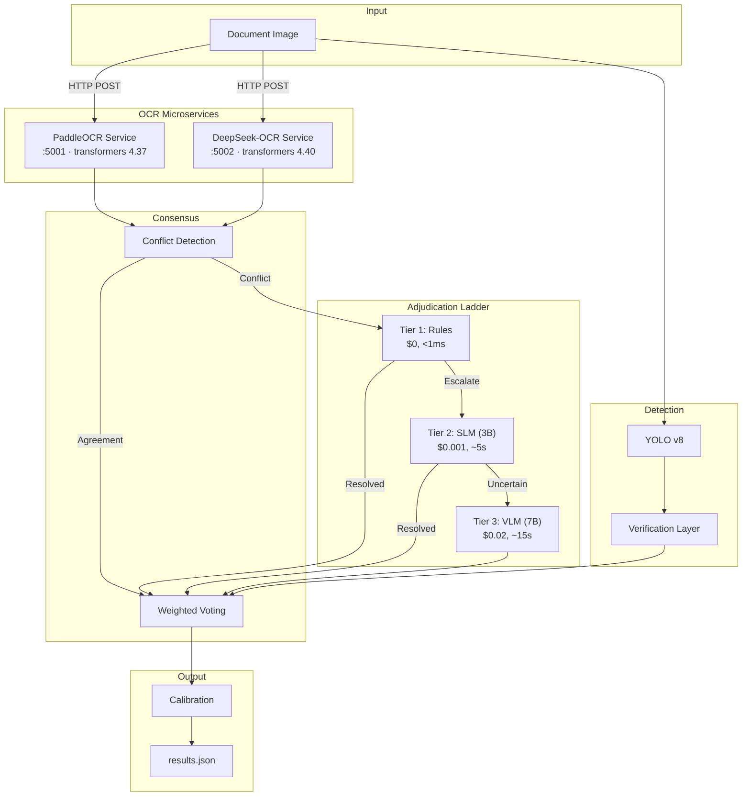

# Intelligent Document AI Pipeline

## Overview

The IDAI Pipeline is a production-grade solution for extracting critical information from tractor loan invoices. It uses a **microservice architecture** to isolate dependency-conflicting OCR engines (PaddleOCR and DeepSeek-OCR) into separate Docker containers, each with its own `transformers` version. The main orchestrator calls both services concurrently via HTTP, then runs a multi-tier adjudication ladder (Rules → SLM → VLM) to resolve conflicts.

### Key Features

-   **Microservice OCR Architecture**: PaddleOCR and DeepSeek-OCR run in isolated Docker containers with independent Python environments, eliminating all `transformers` version conflicts.
-   **Parallel HTTP Inference**: The main pipeline calls both OCR services concurrently using `requests` + `ThreadPoolExecutor`.
-   **Advanced Visual Detection**: YOLOv8 models for signature and stamp detection with geometric verification.
-   **Intelligent Consensus & Adjudication**:
    -   **Tier 1 (Rules)**: Instant, zero-cost resolution for common patterns.
    -   **Tier 2 (SLM)**: Qwen2.5-3B-Instruct (4-bit quantized) for context-aware text verification.
    -   **Tier 3 (VLM)**: Qwen2.5-VL-7B-Instruct (4-bit quantized) for complex visual reasoning.
-   **Cost-Optimized**: Only escalates difficult cases; average cost <$0.01/document.
-   **Field-Level Calibration**: Isotonic regression for reliable confidence scores.

---

## Performance Targets

| Metric | Target | Description |
| :--- | :--- | :--- |
| **Document-Level Accuracy (DLA)** | ≥95% | All 6 fields correct per document |
| **Cost per Document** | <$0.01 | Local OCR + affordable LLM calls |
| **Latency** | <30s | End-to-end processing time |
| **VLM Invocation Rate** | <10% | Only ambiguous cases reach Tier 3 |

---

## Architecture

```
┌─────────────────────────────────────────────────────────────────┐
│                        Docker Compose                          │
│                                                                 │
│  ┌──────────────────┐    ┌──────────────────┐                  │
│  │  paddle-ocr       │    │  deepseek-ocr     │                │
│  │  (Flask :5001)    │    │  (Flask :5002)     │                │
│  │  transformers     │    │  transformers      │                │
│  │  4.37.x           │    │  4.40.x            │                │
│  │  paddlepaddle     │    │  bitsandbytes      │                │
│  │  2.5.2            │    │  4-bit NF4 model   │                │
│  └────────▲─────────┘    └────────▲──────────┘                 │
│           │  HTTP POST /ocr       │  HTTP POST /ocr            │
│           │                       │                             │
│  ┌────────┴───────────────────────┴──────────┐                 │
│  │              pipeline (main app)           │                 │
│  │   ocr_engines.py → parallel HTTP calls     │                 │
│  │   consensus → adjudication → calibration   │                 │
│  │   transformers 4.40.x (SLM + VLM only)     │                 │
│  └────────────────────────────────────────────┘                 │
└─────────────────────────────────────────────────────────────────┘
```



---

## Why Microservices?

**The Problem:** PaddleOCR requires `transformers<=4.37` while DeepSeek-OCR needs `transformers>=4.40`. Installing both in the same Python environment causes import crashes.

**The Solution:** Each OCR engine runs in its own Docker container with pinned dependencies:

| Service | Container | `transformers` | Port |
| :--- | :--- | :--- | :--- |
| PaddleOCR | `idai-paddle-ocr` | `4.37.2` | `5001` |
| DeepSeek-OCR | `idai-deepseek-ocr` | `4.40.2` | `5002` |
| Main Pipeline | `idai-pipeline` | `4.40.2` (SLM/VLM only) | — |

The main pipeline has **zero** PaddleOCR or DeepSeek imports. It sends images to each service via `POST /ocr` and receives structured JSON back.

---

## Quick Start

### Prerequisites

-   Docker & Docker Compose v2+
-   NVIDIA GPU + `nvidia-docker` runtime (for DeepSeek-OCR and VLM)
-   ~20 GB disk space for model downloads

### 1. Start All Services

```bash
# Build and launch all three containers
docker compose up --build

# Or in detached mode
docker compose up --build -d
```

### 2. Run the Pipeline

```bash
# Using Docker Compose (recommended)
docker compose run pipeline --input /app/train --output /app/output/results.json --mode full

# CPU-lite mode (skips Tier 3 VLM)
docker compose run pipeline --input /app/train --output /app/output/results.json --mode cpu-lite
```

### 3. Local Development (without Docker)

If you want to run the services locally without Docker:

```bash
# Terminal 1: Start PaddleOCR service
cd services/paddle_ocr
pip install -r requirements.txt
python app.py  # Runs on :5001

# Terminal 2: Start DeepSeek-OCR service
cd services/deepseek_ocr
pip install -r requirements.txt
python app.py  # Runs on :5002

# Terminal 3: Run the main pipeline
pip install -r requirements.txt
python executable.py --input ./train --output results.json --mode full
```

You can also point to custom service URLs via environment variables:

```bash
PADDLE_OCR_URL=http://my-paddle:5001 \
DEEPSEEK_OCR_URL=http://my-deepseek:5002 \
python executable.py --input ./train --output results.json
```

---

## Extracted Fields

| Field | Type | Description |
| :--- | :--- | :--- |
| **`dealer_name`** | Text | Dealer name (fuzzy matched against master list) |
| **`model_name`** | Text | Tractor model and brand |
| **`horse_power`** | Numeric | Engine power (HP/BHP) |
| **`asset_cost`** | Numeric | Total cost in INR |
| **`signature`** | Visual | Boolean presence + bounding box |
| **`stamp`** | Visual | Boolean presence + bounding box |

---

## Evaluation

```bash
python evaluate.py --predictions output/results.json --golden data/golden_set.json
```

Outputs: DLA, field-level accuracy, mAP (IoU >0.5), cost/latency breakdown, VLM rate.

```bash
# Alternative field-level evaluation
python evaluate_results.py --results results_with_sources.json --golden data/golden_set.json
```

---

## Configuration

### Service URLs (`config.py` or environment variables)

| Variable | Default | Description |
| :--- | :--- | :--- |
| `PADDLE_OCR_URL` | `http://localhost:5001` | PaddleOCR service address |
| `DEEPSEEK_OCR_URL` | `http://localhost:5002` | DeepSeek-OCR service address |
| `OCR_TIMEOUT` | `120` | HTTP timeout in seconds |

### Model Configuration (`config.py`)

-   **SLM**: `Qwen/Qwen2.5-3B-Instruct` (4-bit NF4)
-   **VLM**: `Qwen/Qwen2.5-VL-7B-Instruct` (4-bit NF4)

### Environment Variables

```bash
FLAGS_use_mkldnn=0           # PaddleOCR container only
FLAGS_enable_pir_executor=0  # PaddleOCR container only
CUDA_VISIBLE_DEVICES=0       # GPU selection
TOKENIZERS_PARALLELISM=false # Avoid tokenizer deadlocks
```

---

## Project Structure

```
.
├── docker-compose.yml          # Orchestrates all 3 containers
├── Dockerfile                  # Main pipeline container
├── config.py                   # Central configuration
├── executable.py               # CLI entry point
├── evaluate.py                 # DLA evaluation script
├── evaluate_results.py         # Field-level evaluation script
├── requirements.txt            # Main app deps (no OCR engines)
│
├── services/
│   ├── paddle_ocr/
│   │   ├── Dockerfile          # PaddleOCR container
│   │   ├── requirements.txt    # transformers==4.37.2
│   │   └── app.py              # Flask service (POST /ocr)
│   │
│   └── deepseek_ocr/
│       ├── Dockerfile          # DeepSeek container (nvidia/cuda)
│       ├── requirements.txt    # transformers==4.40.2
│       └── app.py              # Flask service (POST /ocr)
│
├── pipeline/
│   ├── ocr_engines.py          # HTTP client (calls services)
│   ├── main_pipeline.py        # Orchestration logic
│   ├── consensus.py            # Conflict detection & voting
│   ├── adjudicator.py          # 3-tier escalation
│   ├── slm_judge.py            # Tier 2 SLM
│   ├── vlm_judge.py            # Tier 3 VLM
│   ├── detectors.py            # YOLOv8 inference
│   ├── field_parser.py         # Regex-based extraction
│   ├── calibration.py          # Isotonic regression
│   ├── cost_tracker.py         # Usage & cost monitoring
│   └── json_logger.py          # Structured logging
│
├── tools/
│   └── annotator.py            # Streamlit labeling UI
├── tests/                      # Unit tests
├── data/
│   └── golden_set.json         # Ground truth
└── train/                      # Input images
```

---

## Cost & Latency Breakdown

| Component | Cost | Latency |
| :--- | :--- | :--- |
| PaddleOCR Service | $0 | ~2.5s |
| DeepSeek-OCR Service | $0 | ~2.5s |
| YOLO Detection | $0 | ~3s |
| Tier 1 Rules | $0 | <1ms |
| Tier 2 SLM | $0.001/call | ~5s |
| Tier 3 VLM | $0.02/call | ~15s |
| **Average Total** | **<$0.01** | **<30s** |

---

## Running Tests

```bash
python -m pytest tests/ -v
```

---

## License

Proprietary — Hackathon Submission
