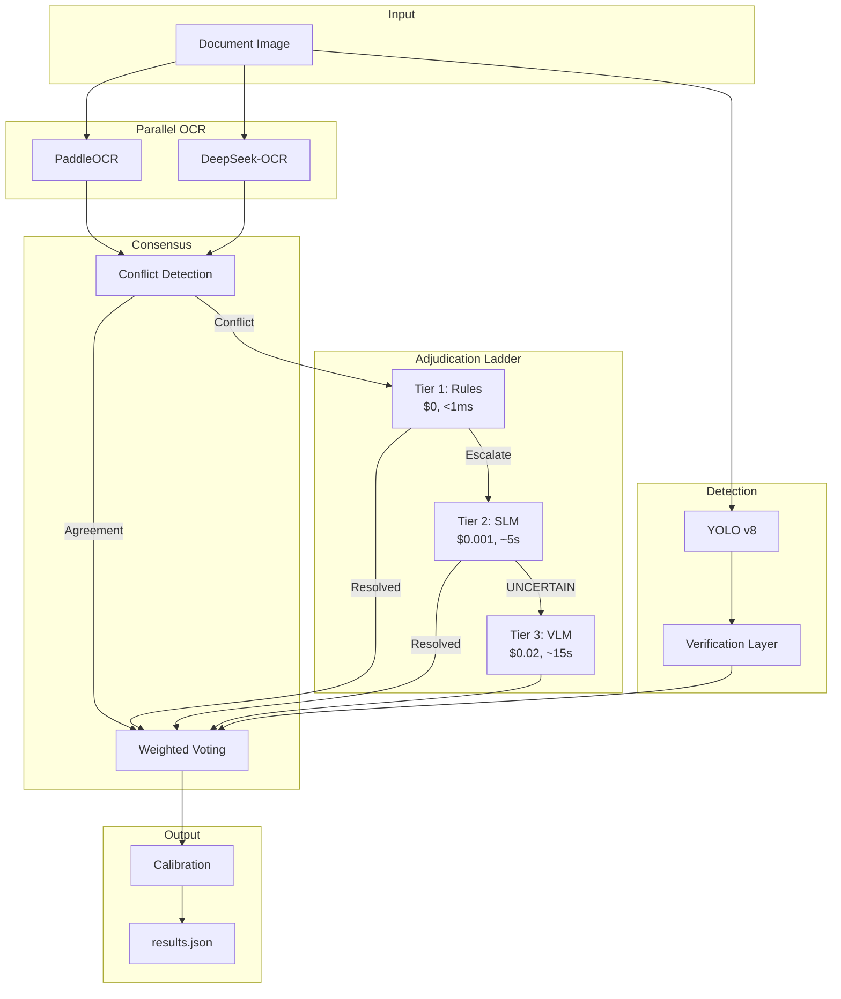

# IDAI Pipeline - Tractor Loan Invoice Extraction

Production-grade Intelligent Document AI pipeline for extracting 6 key fields from tractor loan invoices.

## Target Metrics

| Metric | Target | Description |
|--------|--------|-------------|
| **Document-Level Accuracy** | ≥95% | All 6 fields correct per document |
| **Cost per Document** | <$0.01 | Local OCR/YOLO + affordable LLM calls |
| **Latency** | <30s | Average processing time |
| **VLM Invocation Rate** | <10% | Tier 3 escalation frequency |

## Architecture



## Quick Start

### Installation

```bash
pip install -r requirements.txt
```

### Basic Usage

```bash
# Process a directory of images
python executable.py --input ./train --output results.json --mode full

# CPU-lite mode (skips VLM, faster but less accurate)
python executable.py --input ./train --output results.json --mode cpu-lite

# With calibration from golden set
python executable.py --input ./train --output results.json --golden-set data/golden_set.json
```

### Docker

```bash
# Build
docker build -t idai-pipeline .

# Run
docker run -v $(pwd)/data:/app/data idai-pipeline --input /app/data/train --output /app/data/results.json
```

## Extracted Fields

| Field | Type | Description |
|-------|------|-------------|
| `dealer_name` | Text | Dealer/seller name (fuzzy matched against master list) |
| `model_name` | Text | Tractor model name with brand |
| `horse_power` | Numeric | Engine power in HP/BHP |
| `asset_cost` | Numeric | Price in INR (handles lakhs, commas, native digits) |
| `signature` | Visual | Binary presence + bounding box |
| `stamp` | Visual | Binary presence + bounding box |

## Cost & Latency Breakdown

| Component | Cost | Latency |
|-----------|------|---------|
| PaddleOCR | $0 | ~2.5s |
| DeepSeek-OCR | $0 | ~2.5s |
| YOLO Detection | $0 | ~3s |
| Tier 1 Rules | $0 | <1ms |
| Tier 2 SLM | $0.001/call | ~5s |
| Tier 3 VLM | $0.02/call | ~15s |
| **Average Total** | **<$0.01** | **<30s** |

## How to Generate Golden Set

The golden set requires minimum 50 manually verified documents:

```bash
# Start annotation UI
streamlit run tools/annotator.py

# Or generate synthetic data for training
python tools/synthetic_generator.py --output data/synthetic --count 100
```

### Golden Set Schema

```json
{
  "doc_id": "172427893_3_pg11",
  "image_path": "train/172427893_3_pg11.png",
  "ground_truth": {
    "dealer_name": "ABC Motors Pvt Ltd",
    "model_name": "Mahindra 575 DI",
    "horse_power": 45,
    "asset_cost": 650000,
    "signature": {"present": true, "bbox": [100, 400, 150, 60]},
    "stamp": {"present": true, "bbox": [500, 450, 80, 80]}
  },
  "layout_cluster": 1
}
```

## Evaluation

```bash
# Run evaluation against golden set
python evaluate.py --predictions results.json --golden data/golden_set.json

# Output includes:
# - Document-Level Accuracy (DLA)
# - Field-Level mAP (IoU >0.5 for visual fields)
# - Cost per document
# - Latency per document
# - VLM invocation rate
```

## Project Structure

```
IDFC PS/
├── executable.py           # CLI entry point
├── evaluate.py             # Evaluation script
├── config.py               # Configuration
├── requirements.txt        # Dependencies
├── pipeline/
│   ├── ocr_engines.py      # PaddleOCR + DeepSeek
│   ├── detectors.py        # YOLO + verification
│   ├── field_parser.py     # Field extraction
│   ├── consensus.py        # Conflict detection
│   ├── adjudicator.py      # 3-tier ladder
│   ├── slm_judge.py        # Qwen2.5-1.5B
│   ├── vlm_judge.py        # Qwen2.5-VL-7B
│   ├── calibration.py      # Isotonic regression
│   ├── main_pipeline.py    # Orchestration
│   └── cost_tracker.py     # Cost logging
├── tools/
│   ├── annotator.py        # Streamlit annotation UI
│   └── synthetic_generator.py
├── analysis/
│   └── diagnostics.py      # Error analysis
├── tests/
│   ├── test_field_parser.py
│   ├── test_detectors.py
│   └── test_consensus.py
├── data/
│   └── golden_set.json     # Ground truth
└── train/                  # Input images
```

## Environment Variables

```bash
FLAGS_use_mkldnn=0
FLAGS_enable_pir_executor=0
CUDA_VISIBLE_DEVICES=0
```

## Running Tests

```bash
python -m pytest tests/ -v
```

## License

Proprietary - Hackathon Submission
